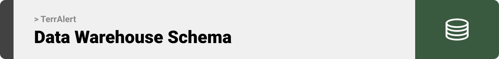
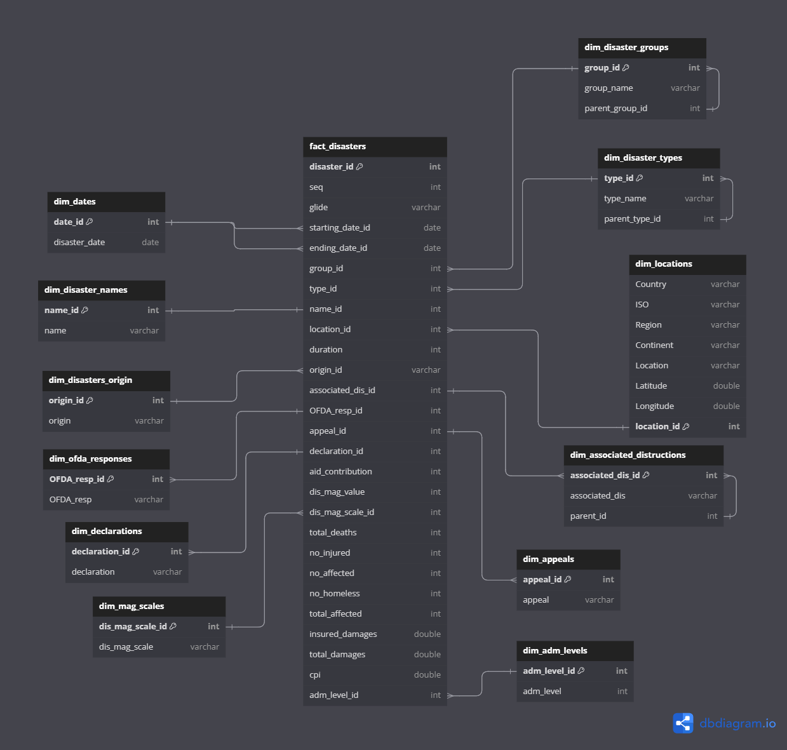
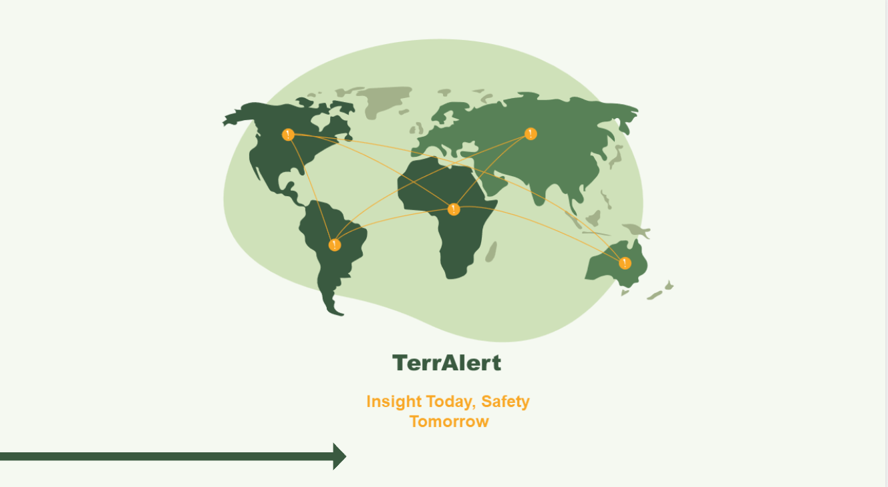
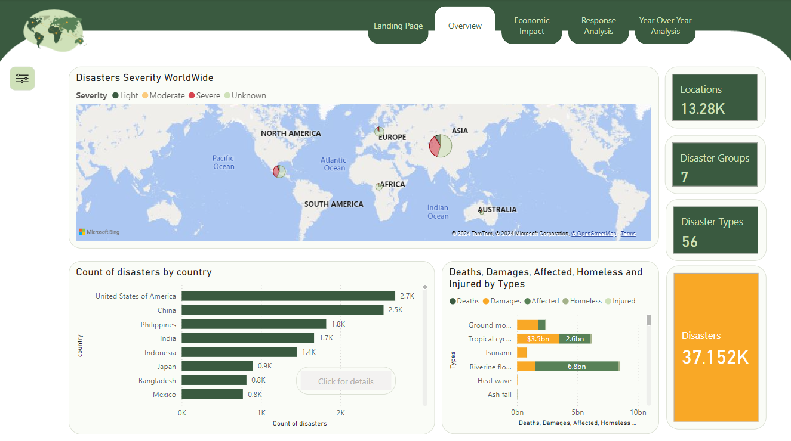
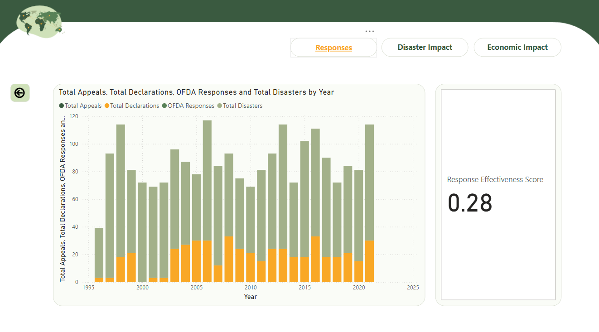
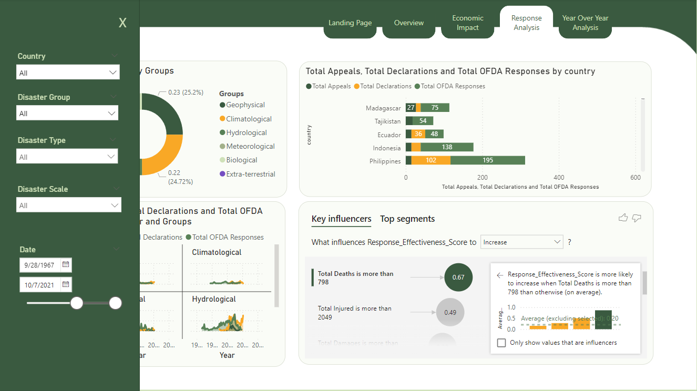
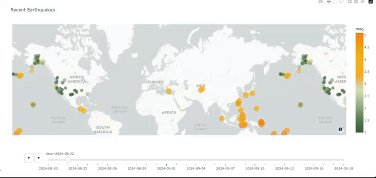
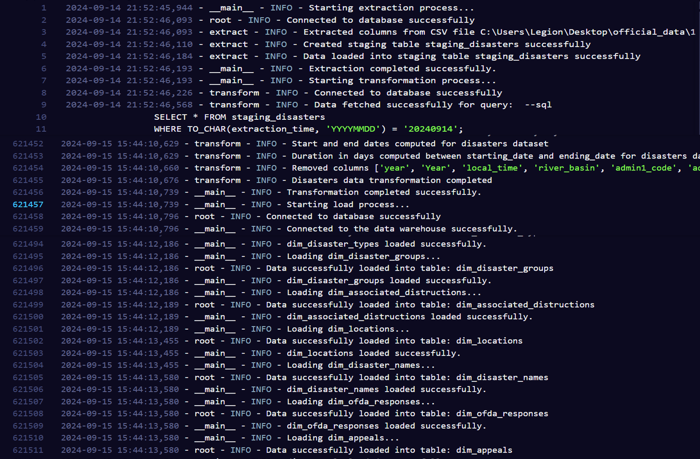

<br><br>

<!-- project philosophy -->


> TerrAlert is a system designed to monitor and analyze natural disasters using both historical and real-time data. It processes past disaster records and combines them with live earthquake data, helping to quickly identify the most vulnerable areas in need of resources during crises.

> Big Picture: The main goal of TerrAlert is to help disaster relief organizations quickly spot ongoing or potential disasters in key areas, making it easier to allocate resources. By integrating real-time data with historical information, the system aims to give decision-makers a clear picture of disaster situations, helping them respond faster and manage aid better.

> While the current version focuses on data processing and visualization, future updates will enhance TerrAlert’s ability to automatically detect high-risk areas and predict zones prone to disasters, getting closer to achieving the full vision of the system.

### User Stories
- As a disaster relief coordinator, I want to monitor real-time data to quickly identify affected regions in need of aid.
- As an analyst, I want to explore historical records of natural disasters to understand trends, impacts, and the responses taken.
- As a data engineer, I want to build a scalable ETL pipeline to continuously update and manage disaster-related data for analysis.

<br><br>
<!-- Tech stack -->


###  TerrAlert is built using the following technologies:

- Python for developing the ETL pipeline and integrating real-time data using the USGS API for earthquake data.
- PostgreSQL as a data warehouse for efficient storage of both real-time and historical disaster data, enabling complex queries and analysis.
- Power BI for creating interactive dashboards to analyze the human and economic impacts of disasters.
- Plotly for real-time visualization of earthquake data, providing a dynamic map of earthquake locations and their magnitudes.

<br><br>


<!-- Database Design -->


###  Star Schema:
The star schema for TerrAlert offers several advantages, including simplicity, as its clear structure with a central fact table and surrounding dimension tables makes data access intuitive and easy to navigate. It provides improved performance for queries on large datasets, crucial for analyzing both historical records and real-time data.




<br><br>


<!-- Implementation -->


### User Screens (Power BI report)

| Landing Page                          | Overview                                |
| ----------------------------------------- | ----------------------------------------- |
|  |  |

| Country-Specific Drill-Through          | Sneak Peek                          |
| --------------------------------- | -------------------------------------- |
|  |  |

### User Screens (Python)

| Real Time Earthquake Monitoring                          | 
| ----------------------------------------- | 
|  |


<br><br>


<!-- Unit Testing -->


###  Ensuring Quality: The Importance of Data Validation:

- Data validation ensures the accuracy of the ETL process through detailed logging. During extraction, logs track data sources and any access issues. In transformation, they document processing steps and validation checks. The loading phase logs capture the success of data uploads and any conflicts. These logs are essential for monitoring data flow and maintaining data quality, ensuring the final dataset is reliable for analysis.
<br><br>

| Logs                        | 
| ----------------------------------------- | 
|  |


<br><br>


<!-- How to run -->


> To set up the TerrAlert locally, follow these steps:

### Prerequisites

Make sure to have the following dependencies installed:

- PostgreSQL
- Required Python libraries (listed in requirements.txt)

### Installation
1. Clone the repository:
   ```
      git clone https://github.com/joudabihaidar/TerrAlert.git
   ```
2. Install the necessary Python libraries:
   ```
      pip install -r requirements.txt
   ```
Now, you should be able to run the project locally and explore its features.
