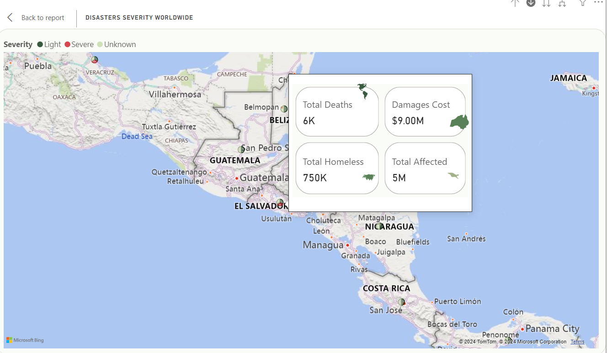
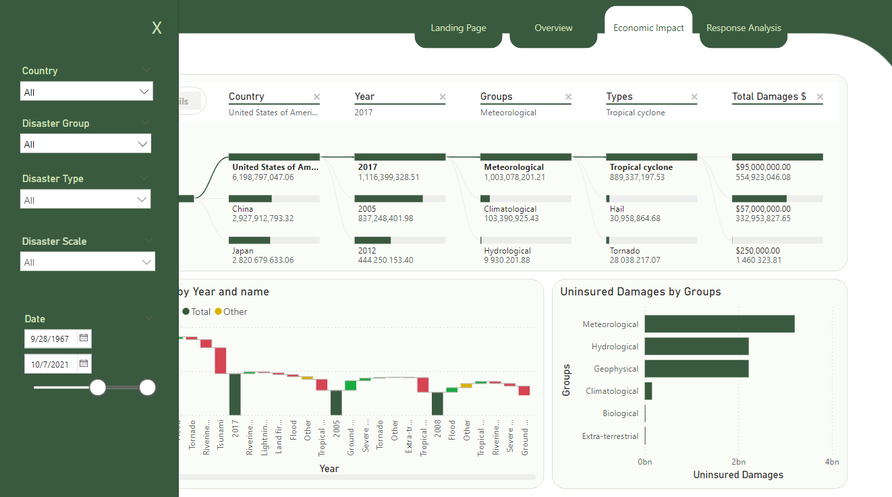
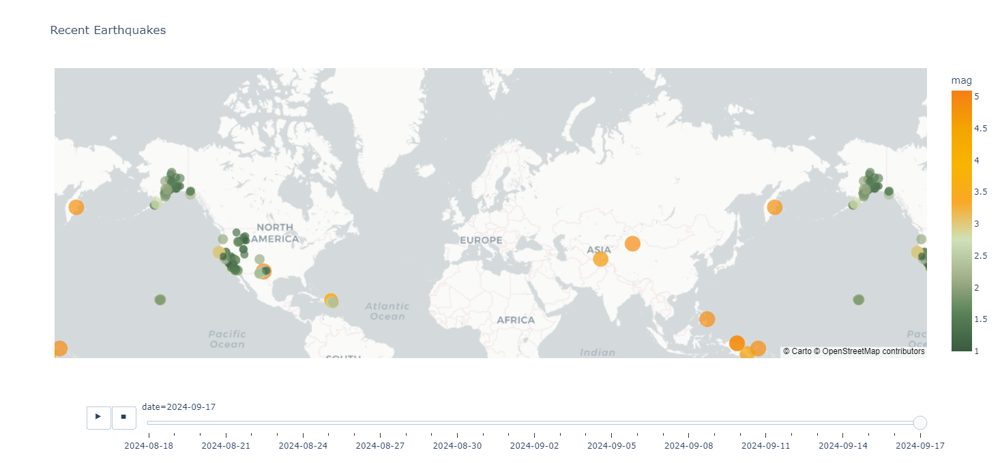

<br><br>

<!-- project philosophy -->


> TerrAlert is a system designed to monitor and analyze natural disasters using both historical and real-time data. It processes past disaster records and combines them with live earthquake data, helping to quickly identify the most vulnerable areas in need of resources during crises.

> Big Picture: The main goal of TerrAlert is to help disaster relief organizations quickly spot ongoing or potential disasters in key areas, making it easier to allocate resources. By integrating real-time data with historical information, the system aims to give decision-makers a clear picture of disaster situations, helping them respond faster and manage aid better.

> While the current version focuses on data processing and visualization, future updates will enhance TerrAlert’s ability to automatically detect high-risk areas and predict zones prone to disasters, getting closer to achieving the full vision of the system.

### User Stories
- As a disaster relief coordinator, I want to monitor real-time data to quickly identify affected regions in need of aid.
- As an analyst, I want to explore historical records of natural disasters to understand trends, impacts, and the responses taken.
- As a data engineer, I want to build a scalable ETL pipeline to continuously update and manage disaster-related data for analysis.

<br><br>
<!-- Tech stack -->


###  TerrAlert is built using the following technologies:

- Python for developing the ETL pipeline and integrating real-time data using the USGS API for earthquake data.
- PostgreSQL as a data warehouse for efficient storage of both real-time and historical disaster data, enabling complex queries and analysis.
- Power BI for creating interactive dashboards to analyze the human and economic impacts of disasters.
- Plotly for real-time visualization of earthquake data, providing a dynamic map of earthquake locations and their magnitudes.

<br><br>


<!-- Database Design -->


###  Architecting Data Excellence: Innovative Database Design Strategies:


<br><br>


<!-- Implementation -->


### User Screens (Power BI report)

| Landing Page                          | Map Overview                                |
| ----------------------------------------- | ----------------------------------------- |
|  |  |

| Country-Specific Drill-Through          | Sneak Peek                          |
| --------------------------------- | -------------------------------------- |
|  |  |

### User Screens (Python)

| Real Time Earthquake Monitoring                          | 
| ----------------------------------------- | 
|  |


<br><br>


<!-- Unit Testing -->


###  Precision in Development: Harnessing the Power of Unit Testing:

- This project employs rigorous unit testing methodologies to ensure the reliability and accuracy of code components. By systematically evaluating individual units of the software, we guarantee a robust foundation, identifying and addressing potential issues early in the development process.

<br><br>


<!-- How to run -->


> To set up Coffee Express locally, follow these steps:

### Prerequisites

This is an example of how to list things you need to use the software and how to install them.
* npm
  ```sh
  npm install npm@latest -g
  ```

### Installation

_Below is an example of how you can instruct your audience on installing and setting up your app. This template doesn't rely on any external dependencies or services._

1. Get a free API Key at [example](https://example.com)
2. Clone the repo
   git clone [github](https://github.com/your_username_/Project-Name.git)
3. Install NPM packages
   ```sh
   npm install
   ```
4. Enter your API in `config.js`
   ```js
   const API_KEY = 'ENTER YOUR API';
   ```

Now, you should be able to run Coffee Express locally and explore its features.
